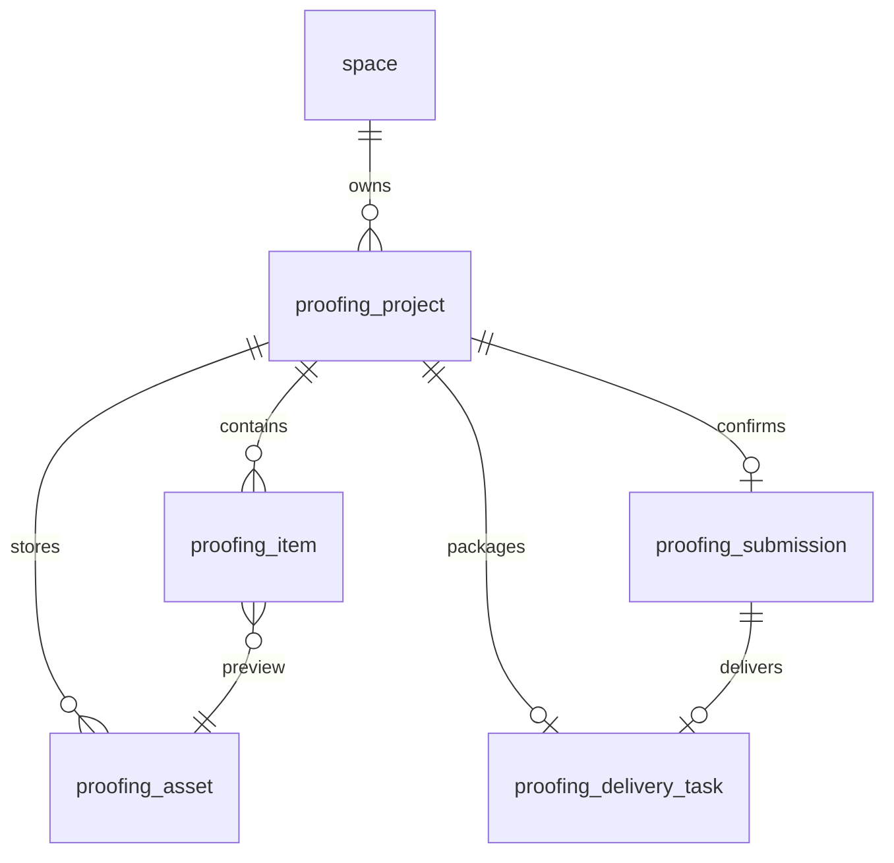

# 摄影团队在线选片与交付：开发手册

> 先做第 1 阶段：创建选片单、查询详情、验证空间权限。不要同时开发全部功能。
>
> 版本：v1.0 · 2026-09-24。本文是待实现的开发设计，不代表功能已经完成。
> 适用项目：当前 Cake Pic 后端；开发方式：你动手实现，按阶段检查代码与验证结果。
>
> 开发要求：优先完成当前阶段可运行、可验证的功能。只实现当前阶段验收必需的字段和功能，不为将来可能出现的需求提前扩展；权限、数据隔离和状态校验等当前功能必需的约束仍要落实。后续阶段需要新字段时再写迁移脚本。
> 教学检查优先指出运行阻断、权限和数据正确性、已约定接口契约的问题；错误码选择等非阻断细节不逐项报告。
> DTO 校验采用非侵入式写法：DTO 保持纯数据对象，不为此添加校验注解或新依赖；当前阶段可在对应 Service Impl 中用属性读取与显式规则表复用校验循环。校验规则由具体操作声明，不从实体字段自动推断。

## 阅读入口

| 现在要做什么 | 阅读位置 |
| --- | --- |
| 明白第一版做什么 | [1. 产品范围](#1-产品范围) |
| 准备改现有项目 | [2. 代码衔接](#2-代码衔接) |
| 建表与写业务规则 | [3. 状态与权限](#3-状态与权限)、[4. 数据设计](#4-数据设计) |
| 写接口与前端 | [5. 接口约定](#5-接口约定)、[6. 页面与交互](#6-页面与交互) |
| 按顺序开发和验收 | [9. 五阶段开发路线](#9-五阶段开发路线)、[10. 验收与演示](#10-验收与演示) |

涉及文件访问时再读第 7 节；涉及异步打包时再读第 8 节。读完当前阶段所需内容就开始写，不必一次记住整本手册。

## 1. 产品范围

### 1.1 一句话定义

为摄影团队提供客户在线选片、圈选修图意见、确认选片清单及成片交付能力。

示例：摄影师上传一组毕业照预览图，客户选出最多 20 张并备注修图要求，确认后摄影师在外部软件修图，再上传成片，客户下载交付包。

### 1.2 第一版完成标准

1. 摄影师创建选片单，上传预览图，设置选片上限并发布链接。
2. 客户无需注册，通过链接进入指定选片单，选择照片、填写文字或矩形圈选批注。
3. 客户确认后，系统固定清单与批注，摄影师能查看确定的修图任务。
4. 摄影师为每张已选照片上传一张成片，系统生成 ZIP，发布交付。
5. 客户通过有效链接下载交付包；链接可以过期或撤销。

### 1.3 首版边界

| 决策 | 首版约定 |
| --- | --- |
| 服务对象 | 一个私人或团队空间处理多个选片单；每个选片单只对应一个客户决策方 |
| 客户身份 | 持有分享链接即获得该单的客户权限；不声称核实了客户真实身份 |
| 多个浏览器 | 共享同一份选片草稿；并发修改用版本冲突提示，不做多人独立投票 |
| 选片规则 | 最少 1 张、最多 `selectionLimit` 张；上限发布前设置，发布后固定 |
| 批注 | 每张照片最多一条文字批注，可附一个矩形；仅已选照片可以填写 |
| 修图方式 | 摄影师在已有修图软件中完成；本系统收集意见和交付文件 |
| 确认规则 | 只允许确认一次；首版不支持撤回确认、补选或重新开放 |
| 成片关系 | 一张已选照片对应一张成片；交付包创建前允许替换成片 |
| 第一版规模 | 每单最多 300 张预览图，最多选 20 张；这只是产品限额，不是压测结论 |
| 文件边界 | 输入 JPEG/PNG，每文件最多 20 MiB、解码后最多 4000 万像素；预览长边最多 1600 px |
| 存储边界 | 每单逻辑存储限额 2 GiB，ZIP 上限 500 MiB；最多 20 个未关闭选片单/空间，先用于小规模试用 |

预览图由后端解码、修正 EXIF 朝向后重编码生成，移除 EXIF 等元数据；选片阶段不把上传的原始大图提供给客户。预览与成片分别保存，不能通过把按钮隐藏来保护成片。

**后续再考虑：**自动修图/AI 搜图、支付套餐、多轮审片、多人实时标注、大文件断点续传。本次不重做已有 Kafka 删除链路。

### 1.4 业务流程


## 2. 代码衔接

### 2.1 已核对的当前源码

以下是 2026-09-24 对工作区源码的静态核对，不是运行验收。工作区存在未提交的包结构重构，不要为了实现手册先覆盖、回退或提交这些改动。

| 现有能力 | 入口 | 新功能如何使用 |
| --- | --- | --- |
| 用户登录 | [UserService](src/main/java/com/sharkycake/user/service/UserService.java) | 摄影师端继续使用现有登录机制 |
| 团队角色 | [SpaceUserAuthManager](src/main/java/com/sharkycake/space/auth/SpaceUserAuthManager.java) | 从选片单所属空间解析当前成员身份 |
| 图片上传参考 | [PictureUploadTemplate](src/main/java/com/sharkycake/picture/upload/PictureUploadTemplate.java) | 参考校验和临时文件处理；现有实现返回拼接 URL，不能原样作为私有交付链路 |
| COS SDK 封装 | [CosManager](src/main/java/com/sharkycake/infrastructure/cos/CosManager.java) | 参考上传、读取、删除方法；当前上传/读取使用配置中的固定桶 |
| 通用响应 | [BaseResponse](src/main/java/com/sharkycake/common/BaseResponse.java) | 继续使用 `{code,data,msg}`，不要另起一套响应格式 |
| Outbox 投递 | [OutboxMessagePublisher](src/main/java/com/sharkycake/infrastructure/outbox/jobs/OutboxMessagePublisher.java) | 后期发送交付打包事件；任务表、消费者和恢复逻辑单独设计 |
| 原图库文件回收 | [PictureFileCleanupServiceImpl](src/main/java/com/sharkycake/picture/service/impl/PictureFileCleanupServiceImpl.java) | 当前只检查 `picture` 的对象引用，新模块不能借用相同对象 Key 后假定它会保留文件 |

当前没有核对前端仓库。本文页面与请求是新增约定，前端路由和框架适配需由你在实现时完成。

AGENTS.md 提到的 `docs/kafka-integration-plan.md`、`docs/kafka-integration-context.md` 在本次工作区不存在；本文不补造其历史验证结果。后续若恢复 Kafka 教学，应先找到或补充真实上下文。

### 2.2 新增模块

保持单个 Spring Boot 应用、单个 MySQL 数据库，新增 `com.sharkycake.proofing`：

```text
proofing/
  controller/     摄影师接口、客户接口
  service/        项目、选片、提交快照、文件和交付任务
  mapper/         新增表的 Mapper
  entity/         持久化实体
  dto/            分操作请求对象
  vo/             摄影师与客户分别定义返回对象
  auth/           分享会话与项目权限解析
  enums/          业务状态与文件类型
  delivery/       第 5 阶段的打包消费者和恢复调度
```

存储适配器建议放在 `infrastructure.cos.ProofingStorageManager`，配置独立私有桶，按 bucket/key 处理文件，不改动原图库的默认桶。

新增 Mapper 后，更新 [MyBatisPlusConfig](src/main/java/com/sharkycake/infrastructure/persistence/MyBatisPlusConfig.java) 的 `@MapperScan`，加入 `com.sharkycake.proofing.mapper`；Mapper XML 仍放 `src/main/resources/mapper`。接口文档如使用包过滤，要实际检查新 Controller 是否出现。

### 2.3 与原图库的数据边界

首版的预览和成片直接在选片单上传，使用独立的 `proofing_asset` 记录及私有对象 Key。原图库仍可按原方式使用。

不让选片单直接引用 `picture.originalKey`、`compressedKey` 或长期 URL。这样原图库删除照片不会损坏已确认的客户清单，也无需修改原来的删除引用模型。

“从图库导入”放到后续：校验来源权限，复制为选片单自己的新对象，确认复制成功后再关联；`sourcePictureId` 最多作为来源记录，不能充当文件存续保证。

## 3. 状态与权限

### 3.1 选片单状态

```text
DRAFT --发布--> SELECTING --客户确认--> CONFIRMED --发布交付--> DELIVERED
  |                |                    |                      |
  +----------------+--------------------+----------------------+
                              关闭 -> CLOSED
```

| 状态 | 摄影师可做 | 客户可做 |
| --- | --- | --- |
| `DRAFT` | 修改设置、上传/移除预览、发布、关闭 | 无法访问 |
| `SELECTING` | 查看草稿进度、管理链接、关闭；不能更改预览和上限 | 看预览、选片、批注、确认 |
| `CONFIRMED` | 查看固定清单、上传/替换成片、请求打包、发布交付、关闭 | 只读确认清单，看到“修图中” |
| `DELIVERED` | 查看交付结果、管理链接、关闭 | 查看确认清单、下载交付包 |
| `CLOSED` | 查看内部记录 | 无法访问 |

`CLOSED` 是业务关闭，不表示 COS 文件已经删除。首版不实现自动删除已关联文件；由小规模试用限额约束存储，正式长期运营前再补保留期与清理策略。

打包任务状态单独维护：`PENDING -> RUNNING -> SUCCEEDED / FAILED`。只有任务成功、全部成片完整，摄影师才能将项目从 `CONFIRMED` 改为 `DELIVERED`。

### 3.2 分享链接是独立状态

`shareEnabled`、`shareExpiresAt`、`shareVersion` 与项目状态分开。

链接过期或被撤销，只关闭客户访问，不回退项目状态、不清空草稿或确认清单。重新生成链接会增加 `shareVersion`，旧链接及旧客户会话都失效。

首版只保留一条当前有效链接；生成后明文令牌仅返回一次，丢失就重新生成。发布项目与生成链接分开，发布响应丢失不会使项目卡住。

### 3.3 权限矩阵

| 操作 | 私人空间所有者 | 团队 admin | 团队 editor | 团队 viewer | 当前单有效客户会话 |
| --- | --- | --- | --- | --- | --- |
| 查看所属空间选片单与清单 | 是 | 是 | 是 | 是 | 只看绑定的一个单 |
| 创建、修改、上传、发布交付 | 是 | 是 | 是 | 否 | 否 |
| 发布选片、生成/撤销链接 | 是 | 是 | 是 | 否 | 否 |
| 关闭选片单 | 是 | 是 | 否 | 否 | 否 |
| 修改选择、批注、确认 | 否 | 否 | 否 | 否 | 仅 `SELECTING` |

首版支持 `PRIVATE` 与 `TEAM` 空间；不支持公共图库。私人空间只由其所有者管理选片单；团队空间按现有成员角色授权。平台管理员不因平台身份自动获得私人或团队选片单权限。私人空间的 proofing 权限需单独核对所有者，不能直接沿用现有 `SpaceUserAuthManager` 对平台管理员的私人空间放行行为。

给团队角色新增 `proofing:view`、`proofing:manage`、`proofing:close` 三个权限。每次员工请求都检查当前私人空间所有权或团队成员关系；不能只在进入页面时检查。

必须从数据库里的选片单得到 `spaceId`。客户端传来的 `spaceId` 只用于创建或筛选，不能覆盖对象的实际归属。

### 3.4 并发规则

第一版采用“短事务锁定选片单主行”的简单方案：一单操作量很小，优先确保规则正确。

1. 开事务，用主键 `SELECT ... FOR UPDATE` 锁选片单；重新检查状态、身份、链接版本和有效期。
2. 校验请求 `expectedVersion == project.version`；冲突则返回业务冲突，前端重新加载后由客户决定是否重试。
3. 校验照片归属，修改选择或批注；选择新增时检查上限，取消选择同时清空该照片批注。
4. 修改实际发生时 `version = version + 1`，同事务提交，返回最新版本。

请求使用 `selected:true/false`，不要使用无参数的“切换选择”。重复设置相同值不会把状态反转；旧版本重发可能返回冲突，前端刷新后即可确认结果。

发布、确认、关闭、链接轮换、成片关联和创建交付任务，也从锁定选片单主行开始；统一顺序为项目行 → 项目内明细/资产行。事务里不访问 COS、不压缩图片、不等 Kafka。

首版每个选片单一条写操作在途，前端按单串行保存；不要并发发送多个携带同一版本的选片请求。

## 4. 数据设计

### 4.1 建模约定

下面是设计字段，不是已执行的 SQL。首版分阶段创建 5 张表，不能把未来设计写成数据库现状。

沿用项目的 camelCase 数据库字段风格；主键用 BIGINT；业务 ID 在 JSON 响应中转换为字符串；时间统一存 UTC，接口使用带时区 ISO 8601。所有表至少有 `id/createTime/updateTime`。

首版不增加通用逻辑删除字段：项目用 `CLOSED`，草稿移除的明细可以物理删除；确认快照和交付任务保留。金额、支付、客户账号不在模型内。

### 4.2 `proofing_project`：选片单主表

阶段 1 先落地 `id`、`spaceId`、`createdBy`、`title`、`status`、`selectionLimit`、`publicId`、`version`、`createTime`、`updateTime`。`publicId` 虽在后续分享阶段使用，但按当前实现决定提前建列，减少以后修改实体；创建选片单时就要生成随机值，并由数据库唯一约束保证不重复。它只是公开定位符，不是访问凭证。下表其余字段到实际使用时再用迁移脚本添加。

| 字段 | 类型建议 | 含义/约束 |
| --- | --- | --- |
| `id`, `spaceId`, `createdBy` | BIGINT | 主键、所属空间、创建者 |
| `publicId` | VARCHAR(64), ascii_bin | 随机公开定位符，唯一；不是访问凭证 |
| `title` | VARCHAR(128) | 客户能看到的标题 |
| `status` | VARCHAR(24) | 五种项目状态之一 |
| `selectionLimit` | INT | 1～20，发布时不能超过有效预览图数量 |
| `version` | BIGINT | 初始 0，每次用户可见业务变更递增 |
| `shareTokenHash` | CHAR(64), ascii_bin, 可空 | 随机分享令牌的 SHA-256 摘要 |
| `shareVersion` | BIGINT | 初始 0，轮换/撤销递增 |
| `shareEnabled`, `shareExpiresAt` | BOOLEAN, DATETIME(3) | 初始禁用；最多设置未来 30 天，可轮换续期 |
| `confirmedAt`, `deliveredAt`, `closedAt` | DATETIME(3), 可空 | 关键业务时间 |

索引：`UNIQUE(publicId)`；`INDEX(spaceId,status,createTime)`。配额计算可在持有项目行锁时汇总本项目资产，首版不增加易漂移的缓存计数。

### 4.3 `proofing_item`：照片与选片草稿

| 字段 | 类型建议 | 含义/约束 |
| --- | --- | --- |
| `id`, `projectId` | BIGINT | 明细与选片单 |
| `previewAssetId` | BIGINT | 该单私有预览资产，发布后不可换 |
| `displayName`, `sortOrder` | VARCHAR(128), INT | 展示名称、固定排序 |
| `selected` | BOOLEAN | 默认 false |
| `annotation` | JSON, 可空 | 一条文字及可选矩形，详见第 6 节 |
| `finalAssetId` | BIGINT, 可空 | 确认且选中后才允许关联；创建交付任务后固定 |

索引：`UNIQUE(projectId,previewAssetId)`；`INDEX(projectId,selected,sortOrder,id)`。所有资产的 `projectId` 必须与明细一致。

明细在 DRAFT 可增删；发布后整组预览固定。不要使用展示名称作为文件唯一标识。

### 4.4 `proofing_asset`：私有文件记录

| 字段 | 类型建议 | 含义/约束 |
| --- | --- | --- |
| `id`, `projectId`, `uploadedBy` | BIGINT | uploadedBy 为员工；ZIP 可记录任务创建者 |
| `kind` | VARCHAR(16) | `PREVIEW`、`FINAL`、`ZIP` |
| `bucket`, `objectKey` | VARCHAR(128), VARCHAR(512) | 服务端生成并控制，不能由客户任意指定 |
| `sizeBytes`, `sha256` | BIGINT, CHAR(64) | 字节大小与校验摘要；未完成上传时摘要可空 |
| `width`, `height`, `contentType` | INT, INT, VARCHAR(64) | 尺寸只对图片有效，使用实际解码结果 |
| `status`, `expiresAt` | VARCHAR(24), DATETIME(3) | `STAGING/READY/DELETE_PENDING/DELETED`；STAGING 有时限 |
| `attemptToken` | VARCHAR(64) | 区分上传或打包的执行批次 |

索引：`UNIQUE(bucket,objectKey)`，Key 索引使用区分大小写的字符集/排序规则；`INDEX(projectId,status)`、`INDEX(status,expiresAt)`。

关联只接受同项目、类型匹配、READY 的资产。Key 每次上传唯一，禁止覆盖已有文件；同一资产不能被跨项目复用。

保存预览成功时，同事务写/关联 item；保存成片成功时，同事务更新 item.finalAssetId。失败或过期执行留下的 Key 只能清理，不能重新变成 READY。第 7 节说明数据库与 COS 间的处理顺序。

### 4.5 `proofing_submission`：不可变确认快照

| 字段 | 类型建议 | 含义/约束 |
| --- | --- | --- |
| `id`, `projectId` | BIGINT | `UNIQUE(projectId)`，一单只确认一次 |
| `requestId` | VARCHAR(64), ascii_bin | 客户端为一次确认生成 UUID；网络重试保持不变 |
| `confirmedVersion` | BIGINT | 本次确认形成的项目版本 |
| `selectionCount` | INT | 快照中的照片数 |
| `manifestJson` | JSON | 有序列表：itemId、displayName、previewAssetId、预览宽高、selected=true、annotation |
| `manifestHash` | CHAR(64) | 对确定顺序和固定序列化规则的清单字节计算 SHA-256 |
| `confirmedAt` | DATETIME(3) | 服务端确认时间 |

确认事务：锁项目 → 验证客户权限 → 检查已有 submission → 检查状态和版本 → 读取已选项并校验上限/批注 → 写快照 → 改为 CONFIRMED 并递增版本 → 提交。

确认重试时，先检查当前客户仍有访问权。如果相同 requestId 已成功，返回原快照，不再次写入；不同 requestId 已确认则返回 ALREADY_CONFIRMED 并允许前端读取已有清单。身份验证不能因为“幂等命中”而跳过。

后续修图列表从 submission 获取，不重新拼装可变草稿。manifestHash 是完整性检查工具，不是客户身份签名或法律效力证明。

### 4.6 `proofing_delivery_task`：交付包任务

| 字段 | 类型建议 | 含义/约束 |
| --- | --- | --- |
| `id`, `projectId`, `submissionId` | BIGINT | `UNIQUE(projectId)`，第一版每单一个交付包 |
| `eventId` | VARCHAR(64), ascii_bin | 唯一，关联 Outbox；消息重发保持同一事件身份 |
| `status` | VARCHAR(16) | PENDING/RUNNING/SUCCEEDED/FAILED |
| `inputManifestJson` | JSON | 固定 itemId、finalAssetId、bucket/key、sizeBytes、sha256 和 ZIP 文件名 |
| `attempt`, `attemptToken` | INT, VARCHAR(64) | 执行次数和当前执行令牌 |
| `leaseUntil`, `nextRetryAt` | DATETIME(3), 可空 | 运行租约和最早重试时间 |
| `outputAssetId` | BIGINT, 可空 | 成功生成的 READY ZIP |
| `lastError` | VARCHAR(1000), 可空 | 可读失败摘要；不包含令牌、完整签名链接或密钥 |

索引：`UNIQUE(eventId)`、`INDEX(status,nextRetryAt)`、`INDEX(status,leaseUntil)`。

创建任务前验证所有已选项都有 READY 成片，固定 inputManifest，并冻结成片关联。任务失败只重试同一输入；首版不允许在已有交付任务下替换成片。必须换片时新建选片单，后续再设计交付修订版本。

### 4.7 关系示意



关系图表示业务关系；是否建立物理外键要与现有迁移习惯统一。无论是否用外键，Service 必须校验归属。READY 文件生命周期由新模块管理，不交给只检查 `picture` 表的旧清理器。

## 5. 接口约定

### 5.1 通用契约

以下路径均相对于现有 `/api`；Controller 中不要重复写应用 context-path。员工端延续现有登录会话，客户端只接受新模块的 `X-Proofing-Session`，两类凭证不能互相代替。

JSON 示例是拟定契约，供开发时对齐，尚不是可调用接口：

```json
{
  "code": 0,
  "data": {
    "projectId": "101",
    "status": "SELECTING",
    "version": 7,
    "selectedCount": 3,
    "selectionLimit": 10
  },
  "msg": "ok"
}
```

新接口也使用 `BaseResponse`。现有异常处理器主要在响应体表达错误，前端必须判断 `code`，不能只看 HTTP 200；不要为了本功能改变所有旧接口的 HTTP 行为。

新业务错误码建议如下，实施前检查与既有值不冲突：

| code | 业务名称 | 客户端动作 |
| --- | --- | --- |
| 40901 | VERSION_CONFLICT | 刷新当前草稿，保留尚未提交的输入供用户重新操作 |
| 40902 | INVALID_STATE | 刷新状态，停止不适用的操作 |
| 40903 | SELECTION_LIMIT_REACHED | 提示上限，恢复本地勾选状态 |
| 40904 | ALREADY_CONFIRMED | 进入已有确认清单 |
| 40905 | ASSET_NOT_READY | 提示重传或等待，不创建残缺交付包 |
| 41001 | SHARE_UNAVAILABLE | 统一显示“链接无效、已过期或已撤销” |
| 42901 | TOO_MANY_REQUESTS | 提示稍后再试 |

常规参数、身份和越权错误复用现有枚举。针对客户越权的项目、item、asset 不暴露它们是否真实存在。

### 5.2 摄影师：项目与预览

| 方法与路径 | 主要输入 | 返回/限制 |
| --- | --- | --- |
| `POST /proofing/projects` | spaceId、title、selectionLimit | 新建 DRAFT，返回详情 |
| `GET /proofing/projects` | spaceId、page、pageSize、status | 分页列表，pageSize 最大 50 |
| `GET /proofing/projects/{id}` | 路径 ID | 元信息、计数、版本；明细单独分页 |
| `PATCH /proofing/projects/{id}` | title、selectionLimit、expectedVersion | 仅 DRAFT 可改 |
| `POST /proofing/projects/{id}/previews` | multipart file、expectedVersion | 生成预览并关联 item；前端分文件依次上传 |
| `DELETE /proofing/projects/{id}/items/{itemId}` | expectedVersion 查询参数 | 仅 DRAFT 移除，返回最新版本 |
| `POST /proofing/projects/{id}/publish` | expectedVersion | DRAFT → SELECTING；至少一张图，上限不能超过图数 |
| `POST /proofing/projects/{id}/close` | expectedVersion | admin 关闭；同时禁用分享并增加 shareVersion |

阶段 1 尚无分享字段和客户会话：关闭接口先保存 `CLOSED` 状态并递增项目版本。阶段 3 增加分享能力时，再在同一关闭事务中禁用分享、递增 `shareVersion`。详情接口的图片计数在阶段 2 建立明细表后补充。

预览上传前后各校验一次状态和权限。图片转换及 COS 上传在事务外，最终关联时必须重新检查版本；上传期间项目已发布，就拒绝关联并记录待清理资产。

创建项目的重复点击由前端防抖；首版只有确认和交付创建承诺业务幂等，不能笼统宣称“所有 POST 都幂等”。

### 5.3 分享链接与客户会话

| 方法与路径 | 输入 | 返回/规则 |
| --- | --- | --- |
| `POST /proofing/projects/{id}/share` | expiresAt、expectedVersion | 生成或轮换链接，仅员工；返回一次明文链接与新版本 |
| `POST /proofing/projects/{id}/share/revoke` | expectedVersion | 禁用链接，失效已有客户会话 |
| `POST /proofing/public/session` | publicId、shareToken | 交换客户会话，返回 token、expiresAt 和 projectId |
| `GET /proofing/public/project` | 客户会话 header | 当前单元信息、状态和版本；不接受外部 spaceId |

链接格式示意：`https://<你的前端域名>/proofing/<publicId>#token=<随机令牌>`。`publicId` 仅定位项目；真正凭证在 fragment，前端读取后通过 POST body 交换会话，并清除地址栏 fragment。

分享令牌用 `SecureRandom` 生成至少 32 字节，再 Base64URL 编码；数据库只保存摘要。客户会话也是独立的高熵随机令牌，Redis 按其摘要保存 `{projectId,shareVersion,expiresAt}`，有效期最多 30 分钟且不能超过分享有效期。

每次客户请求查询项目当前分享状态、版本和业务状态；不能只信 Redis 中“会话存在”。轮换链接后旧会话立即无法发起新业务请求。Redis 不可用时返回访问失败，不能降级放行。

客户会话可保存在前端内存或 sessionStorage，不写长期 localStorage；过期后重新打开分享链接。日志、错误信息和埋点排除分享令牌、客户会话、完整签名 URL。客户页不加载第三方追踪脚本，设置 `Referrer-Policy: no-referrer`。

### 5.4 客户：选片、批注与确认

| 方法与路径 | 输入 | 返回/规则 |
| --- | --- | --- |
| `GET /proofing/public/items` | page、pageSize | 按 sortOrder、id 稳定分页；仅当前单，pageSize 最大 50 |
| `PUT /proofing/public/items/{itemId}/selection` | selected、expectedVersion | 最新选择、selectedCount、version |
| `PUT /proofing/public/items/{itemId}/annotation` | annotation、expectedVersion | 保存批注和新版本；annotation=null 表示删除 |
| `POST /proofing/public/confirm` | requestId、expectedVersion | 固定快照的 id、数量、确认时间 |
| `GET /proofing/public/submission` | 会话 header | 固定清单，未确认则返回明确状态 |
| `POST /proofing/public/assets/{assetId}/access` | 会话 header | 短期 GET URL 和 expiresAt；受第 7 节白名单约束 |
| `GET /proofing/public/delivery` | 会话 header | 是否已交付；已交付时返回 ZIP 资产 ID、大小、时间 |

`GET items` 不返回内部 bucket/key、未交付 finalAssetId、员工身份或原图库 URL。明细响应最多包含客户可见的 previewAssetId；图片访问由 access 接口按需签发，可在同样校验下提供最多 50 个资产的批量签发接口作为后续优化。

客户 `GET items` 在 SELECTING 返回全部发布明细；CONFIRMED/DELIVERED 只返回 submission 中的已选快照项，与资产白名单保持一致。员工接口仍可查看完整内部明细，不能与客户接口共用无过滤的返回对象。

所有 `{itemId}`、`{assetId}` 都要沿项目关系校验，不能拿到 ID 后就直接返回。公开接口不复用原 `PictureVO`。

### 5.5 摄影师：清单与成片交付

| 方法与路径 | 输入 | 返回/规则 |
| --- | --- | --- |
| `GET /proofing/projects/{id}/items` | page、pageSize | 员工明细分页 |
| `GET /proofing/projects/{id}/submission` | 项目 ID | 固定选片/批注清单 |
| `POST /proofing/projects/{id}/items/{itemId}/final` | multipart file、expectedVersion | 上传并关联新成片；仅 CONFIRMED、已选项、尚无交付任务 |
| `POST /proofing/projects/{id}/assets/{assetId}/access` | 员工身份 | 当前私人空间所有者或团队成员有查看权限时，签发该单 READY 资产短链 |
| `POST /proofing/projects/{id}/delivery` | expectedVersion | 固定打包输入，创建任务；重复请求在权限校验后返回同一任务 |
| `GET /proofing/projects/{id}/delivery` | 项目 ID | 当前任务状态、失败摘要、是否可发布 |
| `POST /proofing/projects/{id}/delivery/retry` | expectedVersion | 仅 FAILED，复用固定输入；重复重试不创建新任务 |
| `POST /proofing/projects/{id}/deliver` | expectedVersion | 成功任务存在后转 DELIVERED，发布已有 ZIP |

交付创建的重复请求处理类似确认：先验证权限，再检查已有任务，再做版本/状态校验。不能因 HTTP 重试生成多个 ZIP 业务任务。

## 6. 页面与交互

### 6.1 只做四个页面

| 页面 | 必要内容 | 空态/失败态 |
| --- | --- | --- |
| 员工选片单列表 | 标题、客户流程状态、选中数/上限、创建时间 | 无项目、无权限、加载失败 |
| 员工选片单详情 | 上传预览、发布链接、确认清单、成片上传、打包和交付 | 上传失败、未齐成片、打包失败、链接已撤销 |
| 客户选片页 | 图片网格、大图、已选计数、筛选已选、批注、确认按钮 | 链接不可用、保存冲突、达到上限 |
| 客户确认/交付页 | 固定清单、修图进度文案、成片 ZIP 下载 | 修图中、交付暂不可用、下载链接过期 |

客户端只显示业务语言：例如“已选 8/10 张”“修改已保存”“照片打包失败，请摄影师重试”。异常堆栈、Outbox、Kafka、对象 Key 不进入客户界面。

### 6.2 批注坐标

```json
{
  "expectedVersion": 12,
  "annotation": {
    "text": "这里的路人请去掉",
    "rect": {"x": 0.62, "y": 0.25, "w": 0.15, "h": 0.3}
  }
}
```

坐标相对于**服务端生成且朝向固定的预览图**，取值为 0～1；要求 `w>0`、`h>0`、`x+w<=1`、`y+h<=1`，并拒绝非有限数值。纯文字时 rect 可空，文字最多 500 字符；rect 有值时必须有文字说明。

前端计算坐标时减去图片容器的留白，使用实际渲染图片区域，不使用整个弹窗宽高。缩放后按比例还原矩形。首版不在批注画面中旋转/裁切预览，否则坐标基准会变化。

文字按纯文本显示，不执行 HTML。取消选片会清除该图批注，界面应在用户操作前提示；发布后的预览不能换图，避免批注落在不同图片上。

### 6.3 保存和确认交互

1. 点击选择后串行发送保存请求；失败时恢复界面并显示原因。
2. 批注采用明确的“保存意见”按钮，成功后显示已保存，避免失焦即提交导致版本竞争。
3. 确认前必须等待当前保存完成，展示选中数量和清单，提示确认后不能修改。
4. 确认请求超时，保留同一 requestId 重试；刷新页面则先查询 submission，不能直接生成新请求再确认。

客户页无需首版接入 WebSocket。员工页可手动刷新选片进度；打包任务每 3 秒轮询一次，成功/失败后停止。已有实时编辑功能继续保留在原图库。

## 7. 私有文件、配额与访问

### 7.1 存储选择

新模块使用独立的 COS 私有读写桶，当前通过 `cos.client.proofing-bucket` 配置桶名，沿用 `cos.client.region` 与现有凭证注入方式；不把密钥写入手册、代码、SQL 或浏览器。

当前源码中存在 `host + key` 拼接 URL 的路径，但本次没有读取云端 ACL，不能据此断言现有桶是公有或私有。新桶必须实际验证匿名 GET 返回拒绝；同时检查是否存在可绕过鉴权的 CDN 或静态域名。

腾讯云支持通过预签名 URL 临时访问私有对象；任何持有有效 URL 的人都可使用它。使用官方 SDK 签发 COS 源站地址，不把签名 URL 的域名替换为普通 CDN 地址。[腾讯云预签名授权下载](https://cloud.tencent.cn/document/product/436/14116)

### 7.2 对象组织与上传步骤

对象 Key 由服务端生成，例如 `proofing/{projectId}/{kind}/{randomId}.jpg`。不把用户文件名直接用于目录或权限判定。首版使用后端接收文件再上传 COS；不开放客户端任意 Key 的直传接口。

1. 先检查登录、项目权限和状态；文件写受限临时目录，限制请求体、像素数、格式和处理超时。
2. 在事务外完成图片解码/预览生成，得到实际文件大小；开短事务锁项目，重新校验版本、资产数量和存储配额，登记 STAGING 资产及 15 分钟有效期，提交。
3. 事务外上传唯一 Key；成功后开短事务锁项目，重新校验身份、状态、版本和该资产 STAGING 资格，更新 READY 并关联 item，同事务递增项目版本。
4. 关联失败时保留记录并标记 DELETE_PENDING；关闭文件流，在 finally 删除本地临时文件。不能把“COS 上传成功”直接当成整个业务成功。

所有上传使用有界线程池/连接池与明确超时。STAGING 资产暂按实际待上传字节占用逻辑配额，READY 按实测大小占用，DELETE_PENDING 在对象确认删除前仍占用；DELETED 不占用。

数量预留也要计算未完成 STAGING：预览上传时将“已有 item 数＋未过期的待关联 PREVIEW 资产数”作为 300 张上限的占用，最终关联时在同一事务释放预留并增加明细。只有最终关联成功才消耗新的业务版本，单纯上传失败不会改变客户草稿。

图片预览在重编码后应不超过 2 MiB，超出则继续压缩或拒绝，不能无限循环。首版最终文件只接受 JPEG/PNG，zip 不从外部上传。ZIP 预计预留“输入总大小 + 5 MiB”，实际超出 500 MiB 就失败，不上传超限结果。

每个限额检查都在项目行锁内进行，包括最多 300 个预览、20 个选中项和 2 GiB 资产预算。空间未关闭项目数的 20 单上限，在创建事务中由空间 Service 锁定所属空间行后检查；不要在 Controller 先查数量再插入。

上传传输过程中不锁住项目，最终关联可能因其他人操作而冲突；这属于正常失败路径，前端提示刷新后重传，后台回收孤立资产。

### 7.3 清理边界

新模块只清理自己的 STAGING 超时、DELETE_PENDING 以及无有效关联的上传/打包残留，不能调用旧图片清理器假定其了解新表。清理前同样锁项目并检查 item、submission、delivery input/output 的引用，标记不可再关联后才执行 COS 删除。

删除对象成功后再标 DELETED；删除失败记录原因并重试。超时执行者可能迟到写出对象，因此需要周期核对旧执行批次的对象残留，不能只扫描一次就宣称无孤立文件；保存 tombstone 与 Key 供重复核对。用服务端生成的限定前缀、项目归属和确定 Key 执行删除。

替换尚未冻结的成片后，旧资产进入上述待清理流程；创建任务后禁止替换，使打包输入引用稳定。已关联的预览、确认清单及成功交付文件在首版关闭后继续保留。

2 GiB 是逻辑预算，传输中残留和延迟清理可能使实际 COS 占用短时更高；试用时同时查看桶实际用量。正式长期开放前，需要补充已关闭项目保留期、清理和空间总存储额度策略。

### 7.4 客户可访问的资产白名单

| 项目状态 | 客户可获取访问 URL 的资产 |
| --- | --- |
| SELECTING | 当前项目已发布 item 的 READY PREVIEW |
| CONFIRMED | 确认清单中已选项的 READY PREVIEW |
| DELIVERED | 确认清单的 PREVIEW，以及该项目成功任务唯一 outputAssetId 的 ZIP |
| DRAFT/CLOSED | 无 |

首版不向客户单独签发 FINAL 文件。员工访问也要检查当前私人空间所有权或团队成员关系、项目归属及 READY 状态。

每次签发前检查会话、shareVersion、shareEnabled、有效期和资产白名单；不接受客户端直接传 bucket/key。签名链接 TTL 最多 120 秒，且不能超过会话和分享链接剩余寿命。

撤销分享会立即阻止后续业务请求和新签名签发；已经签发的 URL 在到期前仍可能使用，已经下载的文件无法收回，已开始的传输也可能继续。产品文案应表述为“停止后续访问授权”，不能承诺把已下载文件撤回。

客户数据接口设置 `Cache-Control: no-store`，对象访问避免公共 CDN 缓存；缩略图加载失败可申请新短链。下载采用 SDK 支持的响应头控制文件名，避免把客户输入直接拼进响应头。

### 7.5 小规模试用的限流

会话交换按来源 IP 限速（示例 30 次/分钟），同时按 publicId 限速（示例 60 次/分钟）；写操作按项目和会话限速（示例 120 次/分钟），签发短链每会话 120 次/分钟。计数要原子更新并带过期时间，阈值可依据真实试用调整。

代理后的来源 IP 只接受可信代理设置，不能直接信任任意 `X-Forwarded-For`。限流失败不能影响已保存的选择，界面保留待保存批注。

## 8. 成片打包与失败恢复

### 8.1 复用范围

复用现有 Outbox 表和投递器；新增 topic 建议 `proofing.delivery.requested`，消费者组建议 `proofing-delivery-v1`。事件结构保持精简：

```json
{
  "eventId": "<固定事件标识>",
  "taskId": "301",
  "schemaVersion": 1
}
```

数据库任务是事实来源，消息只是处理触发。消费者从任务表读取固定输入，不接受消息里任意对象地址；不要把含照片、成片链接的巨大清单塞进 Kafka。

### 8.2 创建与执行

1. 创建：锁项目，检查权限/CONFIRMED/已确认清单与全部成片，写 PENDING 任务和 Outbox，同一 MySQL 事务提交；返回 taskId。
2. 抢占：按任务状态和 nextRetryAt 条件更新为 RUNNING，增加 attempt，生成 attemptToken，设置 leaseUntil；提交后才读取文件。
3. 执行：逐个流式读取固定成片并校验摘要，写有大小限制的本地临时 ZIP，登记输出 STAGING 资产，上传到私有 COS。
4. 完成：锁项目和任务，以 RUNNING＋attemptToken 为条件写成功与 READY outputAssetId；若项目已 CLOSED 或执行资格已过期，不能发布输出，将残留资产转清理流程。
5. 交付：摄影师查看成功状态后点击“发布交付”，短事务改项目为 DELIVERED；客户此后才能拿到 ZIP 访问授权。

ZIP 条目使用服务端生成的 `001_<itemId>.jpg` 等稳定名称，扩展名来自已验证格式；可附 `manifest.json`，记录 itemId 与原展示名称映射，内容限当前确认清单。禁止把文件路径、bucket/key、凭证或内部错误放入包中。

不要 `readAllBytes` 把整批图片装进内存。临时空间要覆盖预估 ZIP 和当前处理文件，有界队列满时留任务为待处理；首版每实例最多 1 个打包任务即可。

### 8.3 重复、失败与恢复

| 情况 | 预期处理 |
| --- | --- |
| 相同消息重复到达 | 成功任务直接结束；未到期 RUNNING 不再执行；其余状态用条件更新争抢 |
| 读取 COS、校验或压缩失败 | 按当前 attemptToken 写 FAILED，保存简短原因，释放资源 |
| 进程中断 | RUNNING 租约到期后，由恢复任务推进重试；旧执行者不能覆盖新结果 |
| 上传 ZIP 成功但回写数据库失败 | 新一轮执行可重建；旧 Key 作为孤立对象回收，不能直接标交付成功 |
| Kafka 不可用或 Outbox 达到停止重试状态 | 员工看到 PENDING；数据库恢复扫描仍可触发任务；Outbox 失败另行记录和修复 |

建议租约 5 分钟，每 30 秒续租；抢占、续租、完成、失败更新都带 attemptToken。恢复调度每分钟扫描到期 RUNNING、到期 PENDING 和可自动重试 FAILED，与消费者调用同一个“尝试领取任务”服务，避免两套执行规则。

自动最多执行 3 次，失败后按 1 分钟、5 分钟退避；耗尽后保持 FAILED，员工可手动重试。手动重试需要有效权限和版本，且同一任务至少间隔 60 秒；恢复同一固定输入，重置本轮自动次数，仍使用新的 attemptToken。

ACK 表示消息已转交给持久化任务处理规则：只有数据库状态已经可靠更新或确认任务已存在并由恢复扫描覆盖时才 ACK；数据库不可用时不能吞异常后 ACK。新消费者的错误处理配置需单独验证，不能假定原删除消费者配置自动适配。

关闭项目后不领取新任务；运行中的任务在续租和完成时发现 CLOSED 就停止/丢弃输出，已上传残留进入清理。后台任务不重新依赖创建者仍是空间所有者或团队成员，但客户访问和员工操作始终检查当前权限。

恢复扫描遇到 CLOSED 项目时，将尚未结束的任务按执行令牌条件标为 FAILED，原因记录 PROJECT_CLOSED，禁止自动或人工重试；已经 SUCCEEDED 的任务保留记录，但客户不再获得访问授权。

## 9. 五阶段开发路线

### 9.1 总览与当前进度

估时按“你熟悉当前项目、依赖服务可用、已有前端能扩展、边学边实现”计算，为专注开发时间。总计约 **48～76 小时**，包含最后 6～10 小时集中验收；不含云账号开通、寻找试用用户和不相关环境修复。

| 阶段 | 用时估计 | 可见成果 | 代码状态 | 验证状态 |
| --- | --- | --- | --- | --- |
| 1. 项目与空间权限 | 4～6 小时 | 空间所有者或团队成员能按权限创建并查看选片单 | 后端代码已写：创建、按空间分页列表、详情、仅 DRAFT 修改、关闭；修改与关闭锁项目行并检查版本。列表兼容 `page` 参数并校验继承的 `current` 字段。用户报告已执行建表 | 2026-09-24 独立输出目录离线编译和 `page=2` 参数绑定手动验证通过；JUnit 测试因本机未缓存 Surefire JUnit 平台而未执行。用户报告创建、列表、详情、草稿修改、旧版本冲突、关闭及越权请求均已完成；未留存具体响应与数据库记录，简单前端页面未确认 |
| 2. 私有预览与发布 | 10～16 小时 | 可上传、浏览预览并发布选片 | 进行中：私有桶配置和 ProofingStorageManager 的单文件上传、删除、GET 短时签名方法已写；资产与明细表尚未建 | 2026-09-24 独立输出目录离线编译通过；云端私有访问、签名链接和上传业务尚未验收 |
| 3. 分享与客户选片 | 8～12 小时 | 客户能访问指定单并在上限内选片 | 未开始 | 未验证 |
| 4. 批注与固定清单 | 8～12 小时 | 客户确认，摄影师看到固定修图清单 | 未开始 | 未验证 |
| 5. 成片与交付包 | 12～20 小时 | 成片上传、打包、发布与客户下载 | 未开始 | 未验证 |

**当前下一步：**按 4.4 节编写 `create_proofing_asset.sql`，先建 STAGING/READY 文件记录和唯一 `(bucket,objectKey)` 约束；之后建 item 表并接单张预览上传。匿名访问拒绝与短时签名 URL 可用性放到预览接口完成时一起验收。后面四张表按需要加入。

建表脚本建议分别保存为 `src/main/resources/sql/create_proofing_project.sql`、`create_proofing_asset.sql`、`create_proofing_item.sql`、`create_proofing_submission.sql`、`create_proofing_delivery_task.sql`。文件按阶段创建，并在专用测试库检查实际结构；已有数据库的后续变更另写 ALTER 迁移，不能以 `CREATE TABLE IF NOT EXISTS` 当作自动升级。

第 4 阶段完成后可以请人试用“选片和意见确认”流程，记录反馈；整条产品第一版要到第 5 阶段和验收完成才算完成。

### 9.2 阶段 1：项目与空间权限

**本阶段只回答：谁能在什么私人或团队空间创建和查看什么选片单？**

1. 编写 `proofing_project` 建表脚本、实体、Mapper 和 ProjectStatus 枚举；将新 Mapper 包加入扫描。
2. 增加三种 proofing 权限，明确私人空间所有者及团队 admin/editor/viewer 的映射；编写从 projectId 解析实际 spaceId 的权限服务。
3. 完成创建、列表、详情、DRAFT 修改、关闭接口，版本初始为 0；暂不开放发布和客户访问。
4. 用私人空间所有者、其他用户及团队 admin/editor/viewer/外部成员分别验证成功与拒绝；做一个简单列表和详情页。

**完成证据：**私人空间所有者和同团队 editor 能创建；团队 viewer 可读不能写；私人空间其他用户及外部团队成员用猜到的 ID 也读不到。记录请求、code 和实际数据库变化。

**容易卡住：**Controller 参数里的 spaceId 被当成对象归属；新增 Mapper 未扫描；平台 admin 被错误当作团队 admin 或私人空间所有者。先写两个团队和一个私人空间的数据，越权问题更容易复现。

**第一小步（约 20 分钟）：**写 ProjectStatus 枚举，再列出 DRAFT 能做的操作；不写 COS、不写 Kafka。

### 9.3 阶段 2：私有预览与发布

**本阶段只回答：客户将看到什么文件，文件是否真的受保护？**

1. 配置独立私有桶并新增 ProofingStorageManager；沿用现有 COS 客户端凭证，不改图库默认桶。
2. 建 asset、item 表，先完成单张上传：解码、朝向修正、缩放、去元数据、STAGING → READY → 关联。
3. 做分页预览、短链访问与草稿移除，补上超时/失败资产的受控清理与配额检查。
4. 实现发布和冻结预览，补员工页面；模拟上传过程中另一个请求发布，验证迟到上传不能修改已发布单。

**完成证据：**原始 URL 匿名 GET 被拒绝；有效短链能看预览；已发布后不能换预览或改上限；失败上传没有留下可被客户访问的明细。

**容易卡住：**继续返回旧图库的 host+key URL；只校验后缀却未解码；COS 成功而数据库失败时没有资产记录。

**第一小步（约 20 分钟）：**写 `create_proofing_asset.sql`，让每次上传先有一条可追踪的 STAGING 记录；按 4.4 节保留文件 Key、状态、过期时间及后续清理所需字段。预览接口完成时统一验证匿名拒绝与签名访问。

### 9.4 阶段 3：分享与客户选片

**本阶段只回答：客户只能操作这一单，而且选片上限在并发下仍有效吗？**

1. 实现分享生成/轮换/撤销、随机令牌摘要及 Redis 客户会话。
2. 实现客户项目详情和分页图片列表，使用独立 VO；预览访问只允许当前单的白名单资产。
3. 实现显式 selected 布尔值、项目行锁和 expectedVersion 检查；同事务校验上限并保存。
4. 做客户选片页，验证双浏览器冲突、重复点击和链接失效；不要先做实时广播。

**完成证据：**同单最后一个可选名额并发竞争时最多一个新增选择成功；更换 itemId 不能操作别的单；撤销后旧会话不能继续读取或写入。

**容易卡住：**把“无需注册”写成“无需鉴权”；只判断 token 存在而没有核对 shareVersion；后端上限检查不在事务里。

**第一小步（约 30 分钟）：**先让一个有效分享令牌换到只绑定一个项目的会话，其他写操作仍关闭。

### 9.5 阶段 4：批注与固定清单

**本阶段只回答：确认后的修图需求还能被后续请求悄悄改掉吗？**

1. 保存文字和规范化矩形批注，处理取消选片清空批注和前端图像留白坐标。
2. 建 submission 表，实现行锁、版本校验、唯一项目约束及确认 requestId 幂等。
3. 同事务生成不可变清单、记录确认时间、推进状态；客户和员工从快照读取确认结果。
4. 做确认前预览、确认成功页和摄影师修图列表，测试并发修改与确认、超时重试和旧页面提交。

**完成证据：**同一确认重试只产生一条 submission；确认后选择与批注写入被拒绝；缩放预览后矩形仍指向同一位置。

**容易卡住：**先改项目状态再另开事务保存清单；清单只保存 itemId 没保存批注；客户双击得到两个不同确认结果。

**第一小步（约 20 分钟）：**手写包含两张照片和一条批注的 manifest JSON，用它检查快照是否保留了摄影师实际需要的信息。

### 9.6 阶段 5：成片与交付包

**本阶段只回答：客户能否拿到与确认清单一致的完整成片包？**

1. 先做单张成片上传/关联和完整性检查；不齐成片时明确指出缺哪些 item。
2. 建 delivery_task，完成“创建任务＋Outbox”事务与固定输入；先用一组 3 张小图调试打包核心函数。
3. 接消费者和恢复调度，补条件抢占、attemptToken、租约、重试、孤立文件处理与有界资源限制。
4. 做员工发布交付和客户 ZIP 访问，验证分享授权、ZIP 内容及任务失败重试。
5. 完成第 10 节验收，录制演示，保存使用反馈，再更新 README 与简历。

**完成证据：**ZIP 中照片数量与固定清单一致，文件能打开且摘要匹配；任务重复触发不会产生两个业务交付；中途杀进程后能恢复；未发布交付时客户拿不到 ZIP。

**容易卡住：**遍历项目全部照片而非 inputManifest；在 HTTP 请求里同步等打包；任务一成功就绕过摄影师直接开放下载；旧执行者回写覆盖新执行者。

**第一小步（约 30 分钟）：**从固定的 3 个测试文件生成带稳定条目名的 ZIP，手工解压核对，不先接 Kafka。

### 9.7 每完成一个阶段如何记录

只更新本手册的当前进度和对应阶段记录；不要把设计说明当成完成证明。建议复制以下模板：

```text
阶段：
日期：
代码已完成：具体接口/页面/迁移文件
验证已通过：用例编号、环境、输入与观察到的结果
尚未验证：依赖服务/并发场景/前端兼容性
已确认的设计调整：为什么修改，影响哪个接口和状态
下一步：一个具体文件或一个具体用例
```

后续恢复开发时先核对 git diff 和最新源码，再读本手册对应阶段。由你编写业务代码；需要助手时，一次请求讲解或检查一个阶段。

## 10. 验收与演示

### 10.1 测试数据与验证环境

准备两个团队 A/B；A 中准备 admin、editor、viewer 三个员工账号，B 中准备一个无关账号；再准备一个私人空间及其所有者和另一名用户。准备三个选片单和 12 张可合法使用的测试图片，A 单上限设置 3 张，B 单与私人单用于测试越权。

测试数据不得使用未获允许的人像、客户私密资料或真实分享凭证。并发与故障测试使用独立测试库、测试桶和测试 topic。

现有 [MODULES.md](MODULES.md) 记录了 Maven 测试依赖和集成测试限制；重新验证当时的环境问题是否仍存在，不把 `mvn test` 启动失败写成测试通过。不要直接执行会删除已有数据库内容的旧测试。

### 10.2 主流程

| 编号 | 操作 | 通过条件 |
| --- | --- | --- |
| F01 | editor 创建 A 单，上传 12 张预览，设置上限 3 并发布 | 图片完整、顺序稳定，状态 SELECTING |
| F02 | 客户打开链接，选 3 张，给其中 1 张圈选批注 | 刷新后选择与批注保留；第 4 张被拒绝 |
| F03 | 客户确认，摄影师查看清单 | 只有 3 张及正确批注，状态 CONFIRMED |
| F04 | 先上传 2 张成片并请求打包，再补第 3 张 | 前一次拒绝并指出缺失项；补齐后可创建任务 |
| F05 | 任务成功，摄影师发布交付，客户下载解压 | 三张正确成片，无其他项目文件；manifest 映射正确 |

### 10.3 权限与状态

| 编号 | 操作 | 通过条件 |
| --- | --- | --- |
| A01 | viewer 调用上传/发布；B 员工请求 A 单；非所有者请求私人单 | 拒绝，数据库不变 |
| A02 | A 客户把 itemId 或 assetId 换成 B 单 ID | 拒绝；不返回 B 的名称、地址或对象信息 |
| A03 | 撤销/轮换链接，用旧链接和旧客户会话访问 | 新业务请求被拒绝；已有签名 URL 的剩余有效期按约定观察 |
| A04 | 未发布交付时请求 FINAL/ZIP，匿名请求 COS 对象 | 均拒绝；不能只验证网页按钮隐藏 |
| A05 | CONFIRMED 后写选择/批注，或 CLOSED 后读客户数据 | 拒绝，确认快照不变 |

### 10.4 并发与幂等

| 编号 | 操作 | 通过条件 |
| --- | --- | --- |
| C01 | 上限 3 已选 2，两个客户端同版本并发选择不同照片 | 至多一个成功，总数不超过 3；另一个收到冲突/上限提示 |
| C02 | 同时保存批注和确认 | 只出现符合锁定顺序的一个结果；快照与成功保存版本一致 |
| C03 | 同一 requestId 并发确认、响应丢失后重发 | 只有一个 submission，重复请求返回同一确认结果 |
| C04 | 两个请求同时创建交付任务；重复消费同一事件 | 一条业务任务；重复执行不改变固定输入或重复发布 |
| C05 | 上传期间发布/关闭、打包期间关闭、租约到期后旧 worker 回写 | 迟到操作被拒绝，旧 worker 不能覆盖新状态，残留有清理记录 |

### 10.5 故障与文件

| 编号 | 操作 | 通过条件 |
| --- | --- | --- |
| R01 | COS 上传成功后让数据库回写失败 | 不产生可访问的错误明细；对象可由残留核对流程发现并回收 |
| R02 | 打包中终止进程，重启并等待租约/恢复扫描 | 任务可恢复，只有一个有效输出；记录实际恢复时间 |
| R03 | Kafka 暂停、Redis 不可用、下载签名过期 | 任务持久化可恢复；客户鉴权失败时不放行；可重新申请有效下载链接 |
| R04 | 伪装扩展名、超大像素、过大文件、不合法坐标或 HTML 批注 | 非法图片/坐标拒绝；文字按纯文本显示；临时资源释放 |
| R05 | 读取一张被破坏的成片，或生成超限 ZIP | 整体任务失败，不能以缺失文件的 ZIP 标成功 |

并发用例必须用并发客户端或测试线程执行，不能用两次顺序点击代替。状态和批注校验可写单元测试；锁、唯一约束、重试要用真实 MySQL 集成测试；COS 权限需要实际网络访问验证。

### 10.6 性能记录

先保证 F/A/C/R 用例通过，再记录以下四类事实：

| 指标 | 如何记录 | 不可误写成什么 |
| --- | --- | --- |
| 选片 API 延迟 | 测试机器、并发数、样本数、P50/P95 | 用单次点击声称“高并发” |
| 打包耗时 | 图片张数、总字节、完成时间、是否含上传 | 把 3 张测试图推算成海量吞吐 |
| 故障恢复耗时 | 故障注入时刻、发现时刻、最终成功时刻 | 只配置了重试就写“故障恢复已验证” |
| 实际使用情况 | 试用人数、活动次数、完成选片单数量、反馈 | 把演示账号与假数据写成真实用户 |

### 10.7 两分钟演示脚本

1. **0:00～0:25**：摄影师打开已有 DRAFT 单，展示预览和“最多选 3 张”，发布并复制分享链接。
2. **0:25～1:00**：无痕窗口打开客户页，选择 3 张，尝试第 4 张被阻止，再圈选一处并填写意见。
3. **1:00～1:20**：客户确认；摄影师刷新看到固定清单；展示确认后不能再改。
4. **1:20～1:45**：上传事先准备的三张小成片，创建打包任务并发布交付；如实际打包较慢，录屏明确快进，不伪造即时完成。
5. **1:45～2:00**：客户下载打开 ZIP；摄影师撤销链接，客户新请求被拒绝。短链已签发的有效期另作边界说明。

首次试用可以用“客户选片是否顺利、批注是否看得懂、是否还要在聊天软件补充说明”这三个问题收集反馈。先修复实际阻碍，再决定下一版加什么。

## 11. 开发完成后的项目表达

### 11.1 项目名称与描述

只有实际跑通选片与交付后，再考虑把简历名称调整为：

**摄影团队在线选片与交付平台**

描述示例：

> 面向摄影团队与客户的照片选片交付场景，实现私有预览分享、限额选片、图像批注、确认清单及成片打包交付；基于团队权限与客户访问凭证隔离素材，通过事务控制确认过程，并利用异步任务完成文件打包与失败恢复。

### 11.2 可写进简历的工作条目

以下都是完成并验证后才能使用的模板，不是当前成果：

- 设计选片单状态机，通过项目行锁、版本校验和确认快照处理选片上限、并发修改与重复确认，固定客户修图需求。
- 实现私有素材分享与交付授权，区分团队成员和客户访问范围，支持链接过期、撤销及短期下载授权。
- 基于固定成片清单构建异步交付任务，结合 Outbox、条件抢占和执行令牌处理重复触发、进程中断与迟到回写。

原项目已有的可靠删除和性能优化可以保留最有证据的条目；篇幅有限时压缩普通 CRUD 和组件堆叠，不把每个新表都写成独立亮点。科研助手继续承担 RAG、会话记忆与 Agent 的展示。

### 11.3 保留的证据

1. 一段完整演示视频和可复现的测试数据说明。
2. 核心状态/权限/并发验收记录，包含未通过项及修复过程。
3. 若有真实试用，保留获得同意且去除个人信息的反馈；没有真实用户就明确写个人项目。

## 12. 参考与维护说明

### 12.1 产品参考

- [Pixieset：客户选片与 Favorites](https://help.pixieset.com/hc/en-us/articles/115003733131-How-does-proofing-with-Favorites-work)：参考选片流程。
- [Picflow：图片审阅与反馈](https://help.picflow.com/en/articles/5505195-review-feedback-options)：参考批注和状态交互。
- [腾讯云：预签名授权下载](https://cloud.tencent.cn/document/product/436/14116)：核对私有对象临时访问边界。

产品参考只用于理解业务，不要求复刻其页面或完整功能。依赖服务的具体 SDK 参数在开发时按当前官方文档与项目版本核对。

### 12.2 本次文档交付的边界

本次完成了项目源码入口核对和开发设计，未编写新业务代码、未执行建表、未配置云资源、未运行选片交付测试。所有阶段初始状态为“未开始/未验证”。

本手册放在仓库根目录，因为现有 `.gitignore` 忽略 `docs/`；无需为了保存手册修改忽略规则。此文件未自动提交。实际实现时，将批准或验证过的设计变更与结果写回对应章节。
