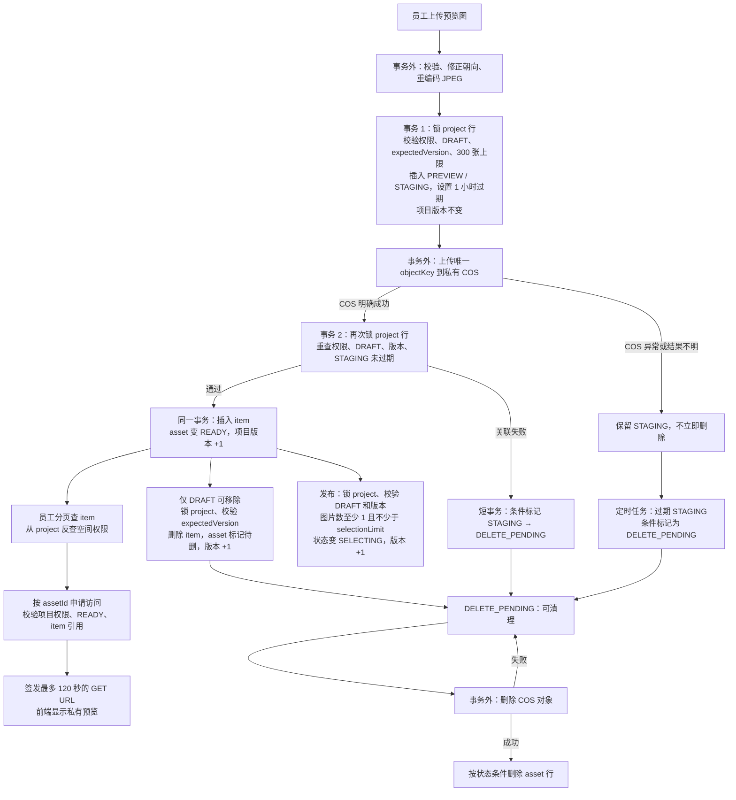

# 第二阶段：私有预览与发布流程图

> 依据当前 proofing 后端源码绘制。图表示已写代码的流程，不代表数据库和 COS 联调已通过。

**复习时记住三点：**

1. 两次上传事务之间是 COS 网络调用，不能用一个数据库事务包住；失败文件靠 `STAGING → DELETE_PENDING` 补偿。
2. 上传完成、草稿移除和发布都先锁同一条项目行，再检查 `DRAFT` 与 `expectedVersion`。发布后，迟到的上传完成和图片移除会被拒绝。
3. 图片列表返回 `itemId`、`previewAssetId` 等展示字段，不返回 COS 地址；签名访问另行校验权限、资产归属、`READY` 和 item 引用。已有签名 URL 在到期前仍可能有效。

对应源码：[上传编排](src/main/java/com/sharkycake/proofing/upload/ProofingPreviewUploadService.java)、[上传短事务](src/main/java/com/sharkycake/proofing/upload/ProofingPreviewTxService.java)、[清理任务](src/main/java/com/sharkycake/proofing/cleanup/ProofingAssetCleanupService.java)、[项目移除与发布](src/main/java/com/sharkycake/proofing/service/impl/ProofingProjectServiceImpl.java)。

真实数据库、私有 COS、并发与失败补偿的验证仍待完成。
