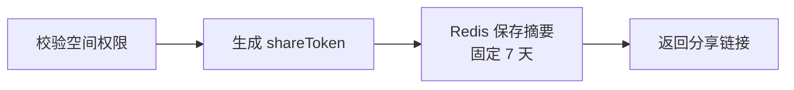
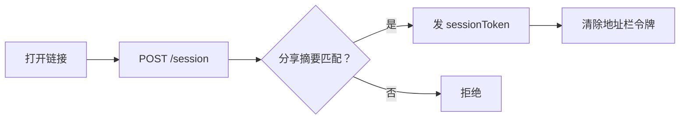
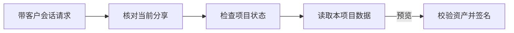
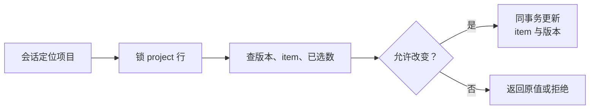
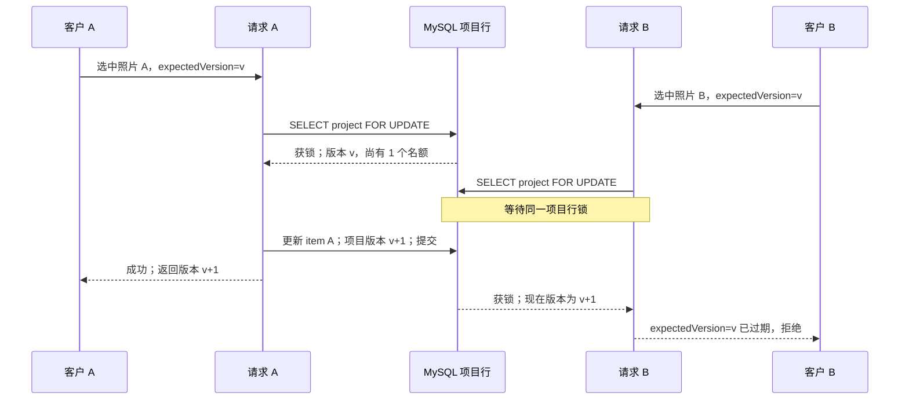

# 第三阶段：分享、客户预览与并发选片

> 按当前 proofing 后端代码绘制。图中的前端动作是接口约定，客户页面尚未实现；编译通过不代表 Redis、MySQL、COS 和并发场景已验收。

## 1. 分享、换会话与预览

以下每个 Mermaid 块都是一张短图；复制到思源笔记时可分别放在三个块中。

### 1.1 员工创建分享

从项目查真实 `spaceId`，校验 `proofing:manage` 和项目状态。令牌由 32 字节安全随机数生成，Redis 的 `proofing:share:{projectId}` 只存摘要；再次创建覆盖旧摘要，撤销时删除该 Key。旧链接和旧会话的新请求随之失效。

### 1.2 客户换会话

前端从 `/proofing/{publicId}#token=...` 读取令牌，在 POST body 提交 `publicId` 和分享令牌。Redis 的会话 Key 为 `SHA-256(sessionToken)`，Value 为 `projectId:当前分享摘要`；TTL 取 30 分钟与分享剩余时间中的较短值。

### 1.3 客户读取项目与照片

会话放在 `X-Proofing-Session` 请求头。项目详情只返回客户可见字段；图片列表只为当前页的可见 item 签名，单张续签只签对应资产。签名前检查资产属于本项目且为 `READY PREVIEW`；URL 最长 10 分钟，且不超过会话和分享的剩余时间。已签发的 COS URL 不会因轮换或撤销立即失效。链接可被持有人转发，当前设计验证的是“持有链接”，不是实名身份。

## 2. 一次选片请求的事务边界

`PUT /proofing/public/items/{itemId}/selection` 显式提交 `selected=true/false` 和 `expectedVersion`，不是 toggle。项目行锁内依次检查 `SELECTING`、版本、item 归属和 `selectionLimit`：旧版本或已满时拒绝；状态本来相同就返回原版本；状态实际改变时更新 item 并让项目版本加一。取消选择不受上限限制。

## 3. 两个客户争夺最后一个名额

**复习时记住三点：**

1. 分享令牌只用于换客户会话；每次客户请求还要核对当前分享摘要和数据库项目状态，所以轮换、撤销、关闭都能阻断后续请求。
2. 客户列表直接返回当前页的图片明细及签名地址；单张续签只返回新地址和过期时间。签名前校验项目、可见 item 与 READY PREVIEW 资产。
3. 选片先锁项目行，再检查版本和上限；item 更新与项目版本递增在同一数据库事务中。第二个并发请求获锁后看见新版本，会被当作旧请求拒绝。

对应源码：[分享与会话](src/main/java/com/sharkycake/proofing/service/impl/ProofingProjectServiceImpl.java)、[客户访问和选片](src/main/java/com/sharkycake/proofing/service/ProofingPublicReadService.java)、[项目行锁 SQL](src/main/resources/mapper/ProofingProjectMapper.xml)、[公开接口](src/main/java/com/sharkycake/proofing/controller/ProofingPublicController.java)。

真实 Redis、数据库、COS、分享撤销与并发选片的 HTTP 验收仍待完成。
