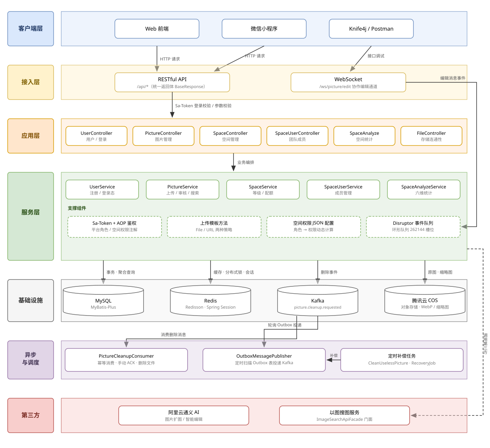
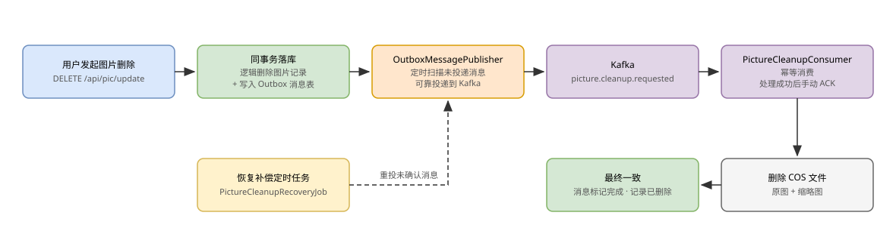

# 🍰 Cake Pic · 照片墙与团队空间管理平台（后端）

> 基于 Spring Boot 3 的图片分享与管理后端服务，提供用户体系、公共/团队空间、图片上传与管理、以图搜图、AI 扩图、在线协作编辑、空间统计分析等能力。

## ✨ 核心功能

| 模块 | 说明 |
| --- | --- |
| 用户体系 | 注册 / 登录 / 退出、平台管理员角色、Sa-Token + Spring Session 双重登录态 |
| 空间管理 | 公共空间与团队空间、空间等级与容量/数量配额、按用户粒度的 Redis 分布式锁创建 |
| 团队成员 | 成员增删改查、角色管理、基于 JSON 权限配置的动态空间权限体系 |
| 图片管理 | 文件 / URL 两种方式上传、分页与缓存分页查询、审核、逻辑删除、批量编辑 |
| 高级能力 | 以图搜图、按主色调搜索、阿里云 AI 扩图、图片抓取 |
| 协作编辑 | WebSocket 图片编辑室 + Disruptor 高性能事件队列，支持进入/退出占用与旋转缩放广播 |
| 可靠删除 | Kafka 异步删除图片 + Outbox 消息表 + 定时补偿任务，保证存储与数据库最终一致 |
| 空间分析 | 容量、分类、标签、体积、上传趋势、空间排行六种统计 |

## 🧱 系统架构



> 架构图源文件：[assets/architecture.drawio](assets/architecture.drawio)，可用 [draw.io](https://app.diagrams.net) 打开编辑；修改后导出图片覆盖 assets/images/ 下对应文件即可。

## 🛠 技术栈

| 分类 | 技术 |
| --- | --- |
| 框架 | Spring Boot 3、Spring MVC、Spring WebSocket |
| ORM / 数据库 | MyBatis-Plus、MySQL |
| 缓存 / 中间件 | Redis（Redisson、Spring Session、缓存与分布式锁）、Kafka |
| 认证鉴权 | Sa-Token（含自定义空间权限 StpInterface）、AOP 注解式权限校验 |
| 高性能队列 | LMAX Disruptor（环形队列 262144 槽位） |
| 对象存储 | 腾讯云 COS（WebP 转换 + 缩略图处理） |
| AI / 第三方 | 阿里云通义 AI 扩图、以图搜图门面 |
| 工具 | Hutool、Lombok、Jsoup、Caffeine、Knife4j（OpenAPI 2 接口文档） |

## 📁 项目结构

```text
src/main/java/com/sharkycake
├── annotation        # 权限校验注解 @AuthCheck
├── aop               # 平台角色拦截器
├── api               # 第三方服务门面（阿里云 AI、以图搜图）
├── common            # 统一返回体 BaseResponse、分页 PageRequest
├── config            # COS / Kafka / Redis / Sa-Token / 线程池等配置
├── consumer          # Kafka 图片清理消费者
├── controller        # HTTP 接口层
├── exception         # 自定义业务异常与全局处理
├── manager           # COS 管理、上传模板、空间权限、WebSocket + Disruptor
├── mapper            # MyBatis-Plus 数据访问
├── model             # entity / dto / vo / enums
├── Schedule          # Outbox 投递与清理补偿定时任务
├── service           # 业务接口与实现
└── utils             # 通用工具
```

## 🔁 亮点：Kafka 可靠删除链路

图片删除采用「本地事务 + Outbox 消息表 + Kafka 异步消费 + 定时补偿」方案，保证数据库记录与 COS 文件的最终一致：



- **消息不丢**：删除事件与业务数据同事务落库，由 Outbox 异步投递 Kafka
- **消费可靠**：手动 ACK + 幂等处理，失败消息由恢复任务重新补偿
- **解耦存储操作**：文件删除耗时不阻塞用户请求

## 🚀 快速开始

### 环境要求

- JDK 17+
- Maven 3.6+
- MySQL 8.x
- Redis 6+
- Kafka 3.x（图片删除链路）
- 腾讯云 COS 存储桶

### 配置

复制 `src/main/resources/application-example.yml` 为 `application.yml`（已在 .gitignore 中，不会被提交），填入你自己的数据库、Redis、Kafka、腾讯云 COS 等连接配置；密钥建议通过环境变量注入。

### 启动

```bash
mvn spring-boot:run
```

服务默认提供：

| 入口 | 地址 |
| --- | --- |
| 健康检查 | `GET /health` |
| 接口文档 | Knife4j（见 `docs/api/` 下的接口总览与联调指南） |

## 📄 接口一览

| 前缀 | 模块 | 说明 |
| --- | --- | --- |
| `/api/user` | 用户 | 注册、登录、退出、用户管理 |
| `/api/pic` | 图片 | 上传、查询、审核、删除、搜索、AI 扩图 |
| `/api/space` | 空间 | 空间 CRUD、等级额度、分页 |
| `/api/spaceUser` | 成员 | 团队成员管理与权限角色 |
| `/api/space/analyze` | 统计 | 六种空间分析维度 |
| `/ws/picture/edit` | 协作 | 图片在线协作编辑 WebSocket |

## 📄 License

本项目仅用于学习与个人作品展示。
